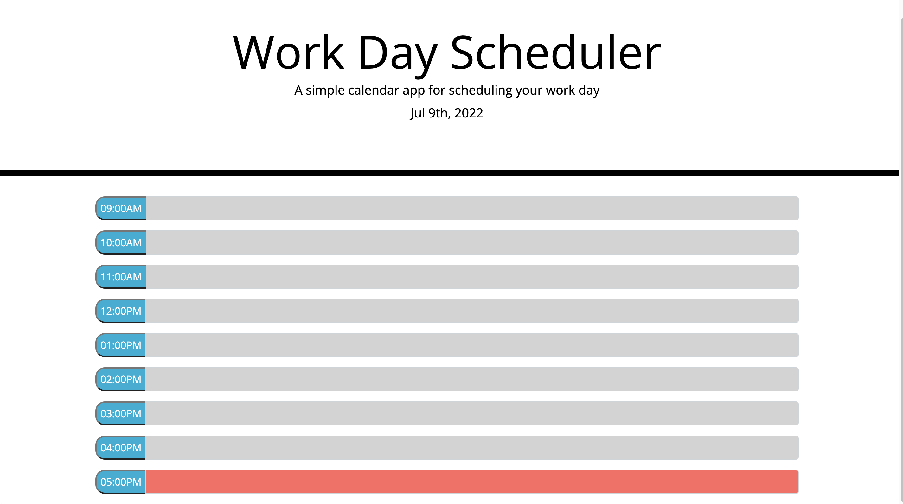

# Bootcamp Challenge: Hourly Task List

## Project Description

This project came with completed HTML and CSS.  The client wanted a daily schedule for the working hours of their day that would change color dependent on the current hour, as well as the function to save tasks with a button and have them stay on the page even if refreshed.  

## Finished Project Preview

[Deployed Project](https://littletonjeffrey.github.io/Calendar/)

[Github Repo Link](https://github.com/littletonjeffrey/Calendar)

## Thoughts Behind The Code

I utilized Bootstrap to build the UI.  I merged the save button into the time indicator for each row to allow for more space.  Utilized Vincent Caruso's advice on how to get the input fields to change color.  

Nine AM was still not working properly until I realized that since moment was tracking time in military time formatted for HH, I had to put a '0' in front of the '9'.  

Had trouble getting items out of local storage and back into their proper place, but my tutor, Eric Sayer, helped me with that.  

Happy to have a functioning program that meets all the client's requirements.

## Contributors

- Computational Wizard: [Eric Sayer](https://github.com/sayex)
- Software Ninjaneer: Vincent Caruso via[Stackoverflow.com](https://stackoverflow.com/questions/62462599/how-can-i-change-elements-style-based-on-the-time-of-day)
